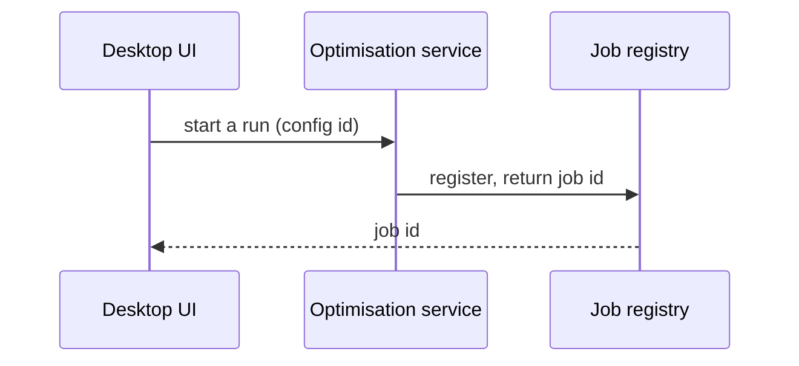
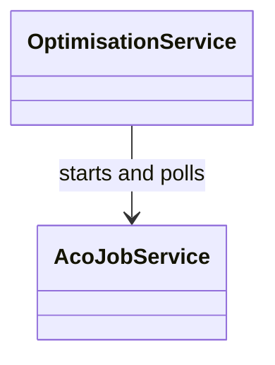

# Explain a system by walking one real request through it

## When to use / when not to

- Use when: someone needs a mental model - of a subsystem, a set of repositories, a data
  flow, a class cluster - for onboarding, a design doc, or a decision.
- Do not use when: the question is "where is X" (search and answer), or the goal is to
  review or change the code (`pr-review` / `debug-root-cause`).

## The one rule that makes the difference

**Read the code, not the documentation about the code.** READMEs and design docs describe
the system as it was intended, and they drift silently. A README that said production
sidestepped a lookup was written before the adapter existed that constructs that very
lookup on line 305. If you explain from the document, you publish the drift and the reader
now believes something false with your name on it.

So: every claim in the explanation traces to a line you opened. Where the existing docs
disagree with the code, say so in the output - that disagreement is usually the single
most valuable thing you will find.

## Steps

### 1. Pin the question

Which system, for which reader, to make which decision? "Explain the optimisation stack"
to someone about to extend it and to someone about to use it are two different documents.
If the user did not say, infer from what they are doing and state your assumption in one
line at the top.

### 2. Find the entry points, and pick one real request

An architecture is only legible as a path. Find where the outside world comes in - an
HTTP route, a command handler, a UI action, a tool call, a `Main` - and choose one
representative request that exercises the interesting part.

Then follow it, opening each hop:

```
grep -rn "class Orchestrator" --include=*.py
grep -rn "\.Handle(\|RegisterCommand\|\[HttpPost" --include=*.cs
```

Record the chain as you go: caller -> callee, and **what data crosses**. The data crossing
each boundary is what the reader actually needs; the class names are just labels for it.

### 3. Name each part by its job, once

For every module, repository or class on the path, write one sentence that would let
someone guess what it does without opening it - in the vocabulary of the problem, not of
the code. "The part that turns a plan into the transmitters the project will actually
get", not "the `ApplyOptimisationResult` command handler".

Expand every acronym the first time. If the domain has three words for one thing, say so;
that ambiguity is usually where new people get lost.

### 4. Draw only what you traced

Diagrams are for relationships that are hard to hold in prose. Two usually carry a whole
subsystem:

````markdown

````

````markdown

````

Rules that keep them readable:

- **Every arrow is a call you read.** An arrow you inferred is a claim you are making.
- **Ten boxes per diagram.** Past that, split by concern - one per repository, one per
  phase - rather than shrinking the boxes.
- **Label the arrow with what crosses it**, not with a method name, whenever the data is
  the point.
- Leave out classes that only exist for plumbing unless the reader must touch them.

### 5. Write it in plain language

The reader is smart and does not know this code. Practical shape:

1. **One sentence** on what the whole thing is for.
2. **One real request, end to end**, in six to ten steps - this is the spine.
3. **Each part's job**, one or two sentences, in the order the request meets them.
4. **The diagrams.**
5. **What is easy to get wrong** - two implementations of the same rule, a name that means
   two things, a fallback that returns "zero" where you would expect "unknown".

Use a concrete analogy where one genuinely fits, and drop it the moment it stops being
true. Keep code out of the prose: name a file or class only when the reader has to go
there, and put anything longer than a name in a fenced block.

### 6. Deliver it as a document when it is for other people

An explanation that only exists in the terminal is gone tomorrow. If it is for a team, a
new joiner, or a decision, publish it as an HTML page (the Artifact tool renders mermaid
natively - no library needed) or write it into the repository's docs. Keep the diagrams
inline in it.

## Traps

- **Alphabetical class lists.** A list of every class with its summary is a reference, not
  an explanation, and nobody reads it twice. Order by the path the request takes.
- **Explaining the code you would have written.** When something looks redundant, find out
  why it is there before presenting it as accidental - that second implementation may be
  the reporting side, which is allowed to differ.
- **Diagram inflation.** Thirty boxes in one picture says "I did not decide what matters".
- **Copying the module's own vocabulary wholesale.** If the code calls three different
  things `context`, the explanation has to give them three names.
- **Silence about the parts you did not verify.** If you did not open the persistence
  layer, say the explanation stops at that boundary.
