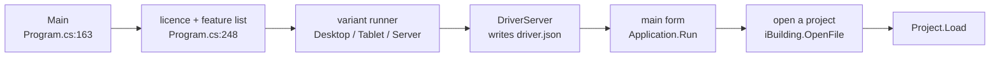
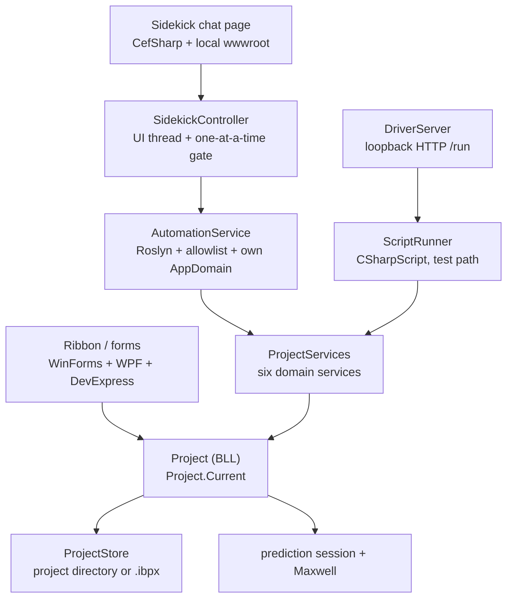
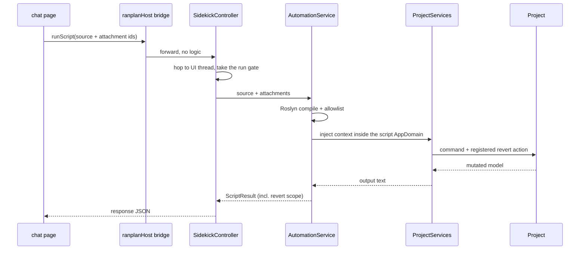

# iBuildNet architecture — the shape of the desktop application

A mental model for someone about to change this code, traced by walking one real request
through it. Every claim below points at a file that was opened; the boundaries that were
*not* traced are listed at the end rather than glossed over.

`repo-notes.md` beside this file covers building, testing and the code style. This file
covers what the pieces are and how a request moves between them.

## What it is

A Windows desktop application that puts a building model and a wireless network in the same
project: draw the building, place the devices, compute coverage, produce the report.
`iBuilding_2010.sln` holds 124 projects — 102 targeting `net472`, 10 `netstandard2.0`,
3 `net8.0`, 1 multi-targeted.

## Stack

| Layer | What | Notes |
| --- | --- | --- |
| Runtime | .NET Framework 4.7.2 | `iBuilding.UI` is a `WinExe` with `<UseWPF>true</UseWPF>` — WinForms is the shell, WPF views sit inside it |
| UI | WinForms + DevExpress + WPF | DevExpress owns the ribbon and the skin; newer panels are WPF (`RanplanWireless.Common.Wpf`) |
| Embedded web | CefSharp.WinForms | The Sidekick chat pane, the 3D antenna pattern, the report viewer and SSO sign-in are all web pages |
| DI | Microsoft.Extensions.DependencyInjection 9.0.7 | Thin in-house wrapper at `Infrastructure/IocContainer`, plus a `ServiceLocator` fallback |
| Scripting | Roslyn (`CodeAnalysis.CSharp.Scripting`) | Two independent paths — see *Two script paths* below |
| Plugins | MEF (`AggregateCatalog` + `DirectoryCatalog`) | Ribbon-menu and context-menu plugins discovered from plugin directories |
| Maths / geometry | MathNet.Spatial (40 projects), MathNet.Numerics | The most widely referenced third-party library here, ahead of Newtonsoft.Json (23) |
| GIS / terrain | GDAL, Ranplan.TinTerrain.Net | Outdoor backgrounds and terrain |
| Propagation | Ranplan.Maxwell (native package) | Reached through the engine-profile abstraction in the BLL |
| Storage | SQLite, JSON | `DeviceDB.db`, the point-signal store; everything else is files under the project directory |
| Tests | NUnit (49 projects) + NSubstitute (43) | Nearly every product project has a paired `*.Tests` |

## Entry points, in the order the outside world reaches them

| What | Where |
| --- | --- |
| Process entry: assembly resolvers, runtime variant, licence gate | `iBuilding.UI/Program.cs:163`, licence at `:248` |
| Startup: DriverServer, main form, message loop | `iBuilding.UI/Startup/Runners/DefaultVariantRunner.cs:68` |
| Static application object: main form, docked panels, `OpenFile` | `iBuilding.UI/DOM/iBuilding.cs:110` |
| Domain root and the single current project | `iBuilding.BLL/Project.cs:97`, `Project.Current` at `:198` |
| Command API surface — what an automation script receives | `RanplanWireless.Professional.SDK.Api/IScriptContext.cs` |
| Command API implementation: six domain services + revert log | `iBuilding.PluginSDK.Runtime/Services/ProjectServices.cs:52` |
| Sidekick chat: host bridge and controller | `iBuilding.UI/Sidekick/SidekickHostBridge.cs`, `SidekickController.cs` |
| Test-automation port: loopback HTTP `POST /run` | `RanplanWireless.Professional.SDK.DriverServer/DriverServer/DriverServer.cs:134` |

Startup is a fixed sequence, and the order is itself a constraint: no valid licence means no
feature list, the feature list decides whether the DriverServer starts, and the main form
comes after both.

## Three entrances, one set of domain services

A person clicking the ribbon, Sidekick running a generated script, and the test harness
posting HTTP all end up mutating the same `Project`.

## One real request, end to end

A user types something in Sidekick and the project changes. This path crosses every
interesting boundary in the application.

1. **The page asks the backend.** The chat page calls the Sidekick service itself; the host
   only supplies the base URL (`getConfig`) and the token (`getAuthState`). Deciding which
   tool to use, and generating the C# script, happens in the cloud — the host takes no part.
2. **The backend needs the script run, so it comes back.** The page turns the tool call into
   `await window.ranplanHost.runScript(requestJson)`. This is the only channel from the
   backend to the local project: the containerised service cannot reach localhost.
   `Sidekick/SidekickHostBridge.cs:40`
3. **The bridge hands over and the thread changes.** CefSharp calls back on a worker thread
   while the project model may only be touched on the UI thread, so the controller marshals
   with `ISynchronizeInvoke` and holds a one-at-a-time gate. Two scripts mutating one project
   concurrently has no meaning. `Sidekick/SidekickController.cs:114`
4. **The compile gate.** The body is wrapped in `Run(IScriptContext context)` under the
   host's pre-imported usings. The reference set is mscorlib, System.Core and the Command API
   assembly, nothing else; banned namespace subtrees (`System.IO`, `System.Net`,
   `System.Reflection`, …) are refused first, then a default-deny allowlist. Violations are
   reported as `AUTO001`. `PluginSDK.Runtime/Automation/ScriptCompiler.cs` + `Analyzers/`
5. **Execution in its own AppDomain.** The script runs in a dedicated script AppDomain with
   `ScriptContext` injected as a cross-domain `MarshalByRef` proxy. Every run gets fresh
   domain services and a fresh revert log; the most recent run is the revertable one.
   `Automation/AutomationService.cs:39`
6. **The script uses the context.** `context.CurrentProject.NetworkModeling` and friends
   resolve to the services assembled in `ProjectServices.cs:70`. User-given names ("3rd floor",
   "RSSI 0") are resolved against the live project at this point; when nothing matches, the
   script reports what the project actually contains rather than asking the user.
7. **Writes become commands, and commands record their inverse.** Each write is a command
   object (`NetworkModelingCommands/`, `BsmCommands/`, `AnnotationCommands/`) that registers
   its revert action on the shared `RunHandle`. That registration is what the Undo button acts
   on. `Services/IRevertibleCommand.cs`
8. **The model changes and the UI follows.** Commands mutate objects under `Project.Current`;
   the model raises events and the panels redraw. The script never touches the UI.
9. **The result goes back out.** The controller maps `ScriptResult` — ran or not, output text,
   `RevertScope`, non-revertable steps, duration — into the bridge response JSON, which the
   page returns to the backend as the tool result. `SidekickController.cs:438`

## Two more data flows

**Opening a project.** A project is not a file, it is a directory tree: material library,
annotations, device library (`DeviceDB.db`, SQLite), system design, propagation configuration,
one set of files per building. `DocumentPath` composes every path. `.ibpx` is the single-file
form of the same thing, chosen by extension at `Project.cs:534`. Every path is an
`IProjectItemInfo` from the ProjectStore SDK rather than a `string`, which is what lets the
same code read a local folder or another store.

**Computing a prediction.** Coverage prediction is its own bounded context. Its source is in
this repository (`iBuilding/RanplanWireless.Sdk.Prediction.*`) but in no solution file; the
application consumes the published 2.5.11 package. Wiring happens in exactly one place,
`iBuilding.UI.PredictionComposition/PredictionDependencyInstaller`, and the host-side port
adapters come from `iBuilding.BLL/Predictions/Providers/BllPredictionPortsRegister` — both are
required, or a `Project` cannot resolve its prediction session. Results come back as per-floor
images and object values (`PredictionFloorImageService`, `PredictionObjectValueService`), not
as an array, and the renderer draws them as heatmaps.

## Easy to get wrong

**The plugin AppDomain fence is off.** `PluginFactory`'s class comment says plugins load
inside an isolated child AppDomain. They do not: the block that creates the domain is
commented out (Task 114804 / PBI 114805) and the code runs `new PluginAppDomainBootstrap()`
in-process. MEF discovery and private-dependency probing still happen, without the boundary.
Reasoning about plugin isolation from that comment gives the wrong answer.

**Two script paths, one compile gate.** The product path is `AutomationService`: Roslyn plus
the allowlist plus its own AppDomain. The test path is the DriverServer's `ScriptRunner`,
which calls `CSharpScript.RunAsync` directly with **no allowlist**, and whose `ScriptContext`
exposes `AutomationService` so test scripts can drive the same automation and call
`RevertLastRun`. "The test script runs" therefore does not imply "the Sidekick script runs".

**Global state.** `Project.Current` and the static `iBuilding` class are the two big global
entrances. Plenty of older code reaches for them directly; new code should not, and they are
the usual obstacle when writing a test.

**The same acronym at different layers.** BSM is building-structure modelling (2D plan editing
mirrored into 3D). SD_LD is system design / layout design, and contains NSD, the network system
diagram. SDM is the system design model, which now also exists as an SDK package. DBM is the
device and material library UI — while the material *data* has moved out to the MDM packages.
A directory name and a package name that share an acronym do not necessarily mean the same
layer.

## Where this description stops

Not opened, so do not cite this document for them: the 3D rendering pipeline internals
(Skia / glTF / XAtlas), the optimisation engine's algorithms (`Optimisation.Engine`, Midaco),
terrain, GIS, reporting and cloud SSO beyond their project boundaries.

Not resolved: whether prediction computation runs in-process or in a separate process.
`RanplanWireless.Sdk.Simulation.ConsoleApp.Runner` is referenced by both the BLL and the UI,
but no call site appears in any `.cs` file — it may be used by reflection or deployed as an
executable.

The expansions given for SDM and SD_LD are inferred from directory contents; no definition was
found in code or specification. The BSM module specification is a GBK-encoded Chinese text file
whose structure, not whose prose, was read.
